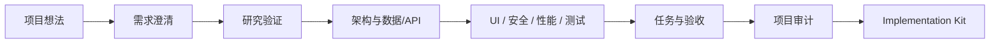

<div align="center">

# Project Factory Core

**把一个模糊想法，逐步沉淀为可实现、可验收、可交接的项目设计。**

*A docs-first project incubation system for AI-assisted software planning.*


</div>

## 为什么需要它

AI 很擅长快速写代码，但项目失败通常不是因为代码写得慢，而是需求、边界、决策、任务和验收没有连起来。Project Factory Core 提供一套仓库级规则、可组合 Skills 和 Wiki 模板，让 Agent 先把项目想清楚，再把实现上下文交给编码工具。

它关注三个结果：

- **设计可追踪**：需求、架构、任务、Prompt、验收和报告通过 ID 串联。
- **不确定性可见**：未经确认的信息进入假设、开放问题或风险登记。
- **交接可执行**：最终生成独立 `implementation-kit/`，供 Codex、Claude Code、Cursor、Copilot 等工具继续实现。

## 工作方式



你可以选择两种模式：

| 模式 | 适合场景 | 使用方式 |
|------|----------|----------|
| 渐进推进 | 关键决策需要逐步确认 | 直接提出当前阶段问题，例如“帮我澄清 MVP 需求” |
| 快速孵化 | 希望一次获得完整设计草案 | 明确说“快速孵化这个项目” |

## 30 秒开始

1. 克隆仓库，并在支持 `AGENTS.md` 和本地 Skills 的 Agent 中打开。
2. 描述项目想法；所有产出会写入新的 `<项目名称>/` 目录。
3. 设计完成后，让 Agent 生成 `implementation-kit/`，复制到独立实现仓库继续编码。

可以直接从这些 Prompt 开始：

```text
我想做一个面向小团队的内部工具，请先澄清愿景、范围和开放问题。
```

```text
快速孵化：一个帮助独立开发者管理用户反馈并规划版本的工具。
```

```text
审计 <项目名称>，检查需求、架构、任务和验收是否一致。
```

## 核心内容

| 内容 | 作用 |
|------|------|
| [AGENTS.md](AGENTS.md) | 仓库级协作规则、阶段边界和提交要求 |
| [.agents/skills/](.agents/skills/) | 34 个项目孵化、设计、治理、质量和交接 Skills |
| [PROJECT_WIKI_TEMPLATE.md](PROJECT_WIKI_TEMPLATE.md) | 项目目录、页面骨架和追踪链路的唯一模板标准 |
| [CONTRIBUTING.md](CONTRIBUTING.md) | Skill 与文档改进的贡献方式 |

Skills 按职责分为：

- 项目定界：discovery、overview、requirements、research
- 方案设计：architecture、data/API、UI、security、performance、test、operations
- 项目治理：assumptions、risk、decision、history、execution log
- 质量控制：stage review、consistency review、project audit、acceptance
- 实现交接：prompt authoring、implementation kit、plain-language handoff

## 产出结构

```text
<项目名称>/
├── HOME.md
├── wiki/                 # 需求、研究、架构、数据/API、交付、质量、运维、历史
├── prompts/              # 逐任务实现 Prompt
├── acceptance/           # 逐任务验收标准
├── tasks/                # backlog / in-progress / done
├── reports/              # review / audit / execution / acceptance
└── implementation-kit/   # 可复制到实现仓库的 AI 上下文包
```

完整页面说明见 [PROJECT_WIKI_TEMPLATE.md](PROJECT_WIKI_TEMPLATE.md)。

## 设计原则

- 文档优先，但不为了文档而文档。
- 先复用现有 Skill，不为单一场景增加新抽象。
- 研究结论必须有证据；未知内容必须显式标注。
- 阶段产出需要 review，最终交接前需要全项目 audit。
- 本仓库只负责孵化和交接，不承载产品实现代码。

## 当前状态

项目处于早期公开准备阶段。核心工作流和 34 个 Skill 已就绪，仓库校验可运行：

```powershell
python scripts/validate_repo.py
```

近期重点是用更多真实项目验证 Skill 的触发准确性、阶段依赖和交接质量。

## 参与贡献

欢迎提交以下类型的改进：

- 可复现的 Skill 触发或执行问题
- 跨文档契约冲突和模板漂移
- 更清晰、更通用的示例或验收规则
- 真实项目孵化后的复盘结论

开始前请阅读 [CONTRIBUTING.md](CONTRIBUTING.md)。

## License

开源许可证尚待仓库所有者确认。在许可证加入前，本仓库默认保留所有权利；请勿假定可以复制、修改或再分发。
